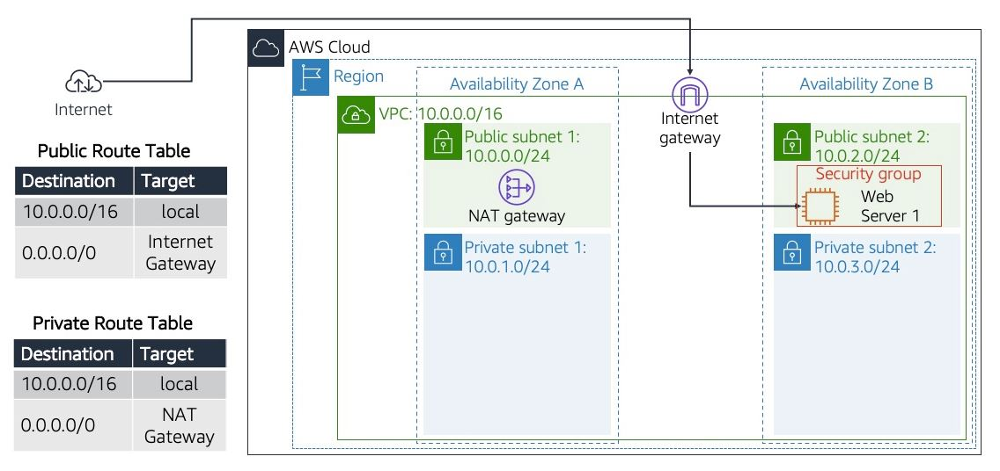

## Objectives

 - Create a Virtual Private Cloud (VPC)
 - Create subnets
 - Configure a Security Group
 - Launch an Amazon Elastic Compute Cloud (Amazon EC2) instance and Web Server into a VPC

### Task 1: Create a VPC
Amazon Virtual Private Cloud is a virtual network that allows you to launch AWS resources that you define. With VPC, you have full control over your network settings, including IP address ranges, subnets, and routing tables, giving you a secure and customizable space to run your applications and services in the cloud.

After creating a VPC, you can add subnets. If a subnet's traffic is routed to an internet gateway, the subnet is known as a public subnet. If a subnet does not have a route to the internet gateway, the subnet is known as a private subnet.

The architectural diagram would look like this: 
 

 1.  In the AWS Management Console, select the **Services** menu, and then select **VPC** under **Networking & Content Delivery**.
 2. Choose **Create a VPC** and select **VPC and more**.
 3. Under **Name tag auto-generation**, enter the name of your VPC. For this tutorial, let's name it TestVPC.
 4. Select Number of Availability Zones (AZs): **2**
 
 * Number of public subnets: **2**
 * Number of private subnets: **2**
 
 5. Expand the option **Customize subnets CIDR blocks**
 Enter the following values based on the architectural diagram above:
   * Public subnet1 CIDR block: **10.0.0.0/24**
   * Public subnet2 CIDR block: **10.0.2.0/24**
   * Private subnet1 CIDR block: **10.0.1.0/24**
   * Private subnet2 CIDR block: **10.0.3.0/24**

For reference on CIDR allocation and calculation, you can check  [here](https://medium.com/geekculture/aws-vpc-and-subnet-cidr-calculation-and-allocation-cfbe69050712).  I find the article very helpful and easy to digest for beginners.
 
 6. Choose **Create VPC**.
 
 ### Task 2: Create a VPC Security Group
 In this task, you create a VPC security group, which acts as a virtual firewall for your instance. When you launch an instance, you associate one or more security groups with the instance. You can add rules to each security group that allow traffic to or from its associated instances.
 
 
 7. In the left navigation pane, choose **Security Groups**.
 8. Choose **Create security group**.
 9. Configure the security group with you desired options:
 For Example:
	  * **Security group name:** VPC Web Security Group
	  * **Description:** Enable HTTP access
	  * **VPC:** Choose the VPC we created earlier (TestVPC)
 10. Under **Inbound rules**, select **Add rule**.
	 * **Type:** Choose **HTTP**
	 * **Source:** Choose **Anywhere**
	 * **Description - optional:** You may add for example `permit web access`
 11. Choose **Create security group**.
### Task 3: Launch a web server instance
In this task, you launch an EC2 instance into the VPC. You configure the instance to act as a web server.
 
 
 12. In the AWS Management Console, select the **Services** menu, and then select **EC2** under **Compute**.
 13. Choose **Launch instance**
 14. Choose a **Name** for your instance. For example: My Web Server.
 15. Choose an **Amazon Machine Image (AMI)**, which contains the desired operating system. You can select an **AMI**,  and **Instance type** that is part of the **Free tier**.
 16. You can create a key pair to securely connect to your instance (via SSH). Ensure that you have access to the selected key pair before you launch the instance. For this tutorial, we wont be connecting to the instance remotely. If you decide to create a keypair, make sure to add SSH on port 22 under **Inbound rules** on the **Security Group** we created earlier (VPC Web Security Group).
 17. For **Network settings**, select **Edit**
	 * **VPC**: Choose your VPC (**TestVPC**)
	 * **Subnet**: Choose the **Public subnet 2**. (Be careful not to choose the private subnet.)
	 * **Auto-assign Public IP**: Choose **Enable**.
	 * ****Firewall (security groups)****: Choose **Select existing security group** and select the security group we created earlier (VPC Web Security Group).
 18. At the bottom of the page, expand the **Advanced Details** section.
 19. Copy and paste the following code into the **User data** box:
 
```
#!/bin/bash
sudo yum update -y
#Install Apache Web Server
sudo yum install httpd -y
sudo systemctl start httpd
sudo systemctl enable httpd
echo "Hello World" > /var/www/html/index.html
```
This script runs automatically when the instance launches for the first time. The script installs and starts an Apache web server.

 

 20. Choose **Launch instance**
 21. Choose **View instance**
 22. Wait until the instance shows **2/2 checks passed** in the **Status check** column.
 23. You now connect to the web server running on the EC2 instance.
 24. Select the check box for the instance, and choose the **Details** tab.
 25. Copy the **Public IPv4 address** value.
 26. Open a new web browser tab, paste the **Public IPv4 address** value, and press Enter. For example: http://ipaddress
 When successful, the page should show a message **It works!** or an Apache default web server page.